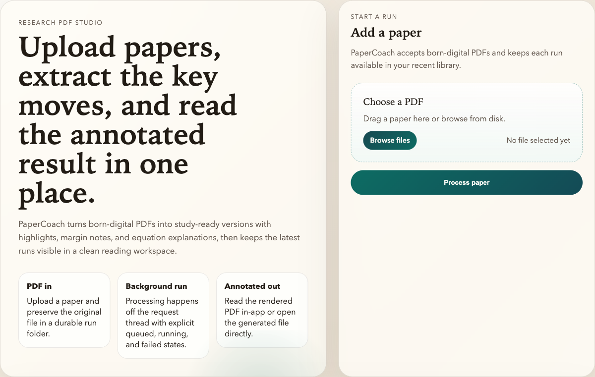
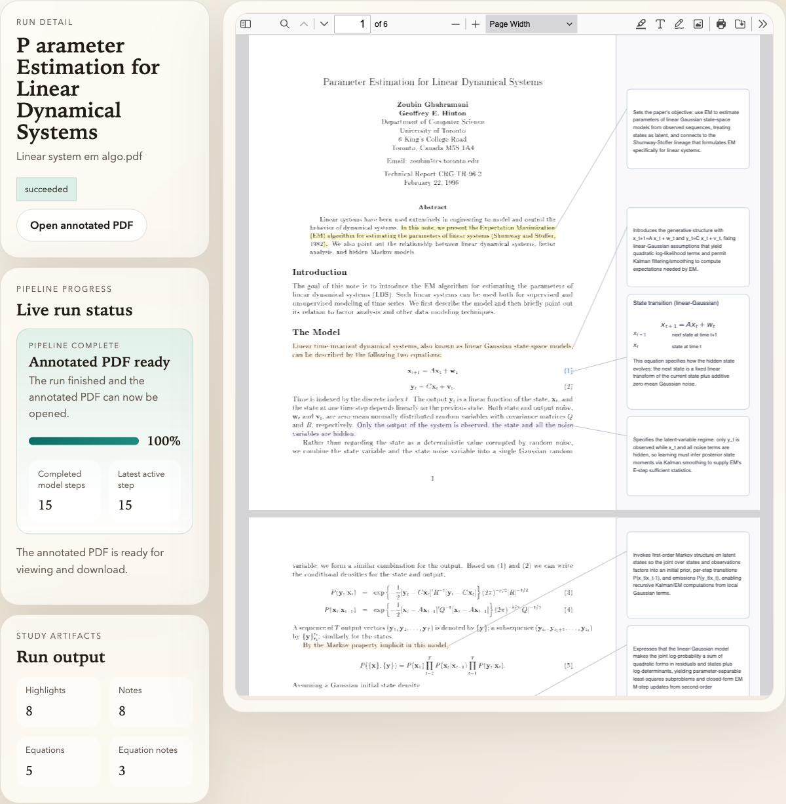

# PaperCoach

PaperCoach is a local research PDF studio. Upload a born-digital paper, let the
pipeline extract the key ideas, and review the annotated result in an embedded
viewer with highlights, margin notes, and equation explanations.

<p align="center">
  
  
</p>

## What It Does

- Ingests born-digital PDFs and keeps each run on disk.
- Generates study-ready highlights, notes, and equation callouts.
- Shows progress and outputs in a single local web workspace.
- Opens the final annotated PDF in an embedded PDF.js reader.

## Quick Start

Install the project:

```bash
python3 -m pip install -e .
python3 -m pip install -e '.[dev]'
```

Start a backend. By default PaperCoach expects an OpenAI-compatible endpoint at
`http://127.0.0.1:8000/v1`.

Use local ChatMock (installed separately):

```bash
chatmock serve
```

Or use OpenAI directly:

```bash
export OPENAI_API_KEY=your-key
export PAPERCOACH_MODEL=gpt-5
```

If your local backend is not on `:8000`, point PaperCoach at it explicitly:

```bash
export PAPERCOACH_BASE_URL=http://127.0.0.1:8001/v1
export PAPERCOACH_API_KEY=dummy
export PAPERCOACH_MODEL=gpt-5
```

Run the web app:

```bash
papercoach serve --host 127.0.0.1 --port 8080
```

Open [http://127.0.0.1:8080](http://127.0.0.1:8080).

## CLI

```bash
papercoach highlight papers/example.pdf --out output/pdf/example-highlighted.pdf --workdir runs/example
papercoach highlight-plan papers/example.pdf --workdir runs/example
papercoach render-highlights papers/example.pdf runs/example/highlight_plan.json --out output/pdf/example-highlighted.pdf --workdir runs/example
```

## Outputs

Each run writes its own working set:

- `runs/<paper-slug>/highlight_plan.json`
- `runs/<paper-slug>/run_manifest.json`
- `runs/<paper-slug>/trace.jsonl`
- `output/pdf/<paper-slug>-highlighted.pdf`

## Constraints

- Only born-digital PDFs are supported.
- The configured model must exist on the selected backend.
- The product is optimized around local runs and persistent on-disk artifacts.

## Stack

PaperCoach is built on PyMuPDF, FastAPI, PDF.js, and an OpenAI-compatible model
backend such as ChatMock.
