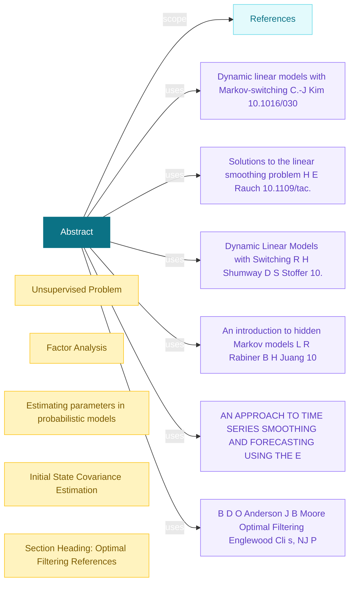

# Mind Map

```mermaid
flowchart LR
    root["Abstract"]
    s1["References"]
    m1["Unsupervised Problem"]
    m2["Factor Analysis"]
    m3["Estimating parameters in probabilistic models"]
    m4["Initial State Covariance Estimation"]
    m5["Section Heading: Optimal Filtering References"]
    c0["Dynamic linear models with Markov-switching C.-J Kim 10.1016/030"]
    c1["Solutions to the linear smoothing problem H E Rauch 10.1109/tac."]
    c2["Dynamic Linear Models with Switching R H Shumway D S Stoffer 10."]
    c3["An introduction to hidden Markov models L R Rabiner B H Juang 10"]
    c4["AN APPROACH TO TIME SERIES SMOOTHING AND FORECASTING USING THE E"]
    c5["B D O Anderson J B Moore Optimal Filtering Englewood Cli s, NJ P"]
    root -- "scope" --> s1
    root -- "uses" --> c0
    root -- "uses" --> c1
    root -- "uses" --> c2
    root -- "uses" --> c3
    root -- "uses" --> c4
    root -- "uses" --> c5
    classDef root fill:#0b7285,color:#fff,stroke:#0b7285,stroke-width:2px;
    classDef section fill:#e3fafc,stroke:#66d9e8,color:#0b7285;
    classDef method fill:#fff3bf,stroke:#fcc419,color:#7c5b00;
    classDef result fill:#d3f9d8,stroke:#69db7c,color:#2b8a3e;
    classDef assumption fill:#ffe3e3,stroke:#ff8787,color:#c92a2a;
    classDef citation fill:#f3f0ff,stroke:#9775fa,color:#5f3dc4;
    class root root;
    class s1 section;
    class m1 method;
    class m2 method;
    class m3 method;
    class m4 method;
    class m5 method;
    class c0 citation;
    class c1 citation;
    class c2 citation;
    class c3 citation;
    class c4 citation;
    class c5 citation;
```
