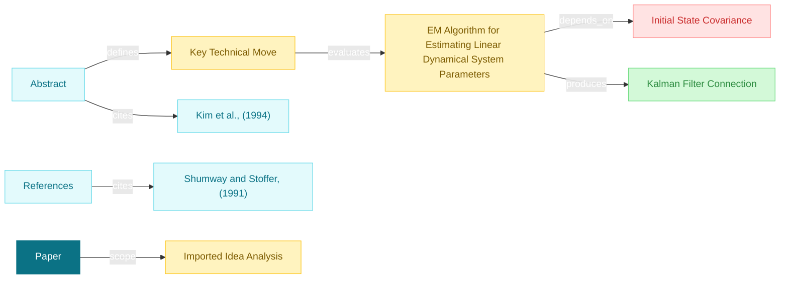

# Mind Map

```mermaid
flowchart LR
    root["Paper"]
    section_1["Abstract"]
    result_1["Key Technical Move"]
    citation_1["Kim et al., (1994)"]
    section_2["References"]
    method_1["EM Algorithm for Estimating Linear Dynamical System Parameters"]
    assumption_1["Initial State Covariance"]
    result_2["Kalman Filter Connection"]
    citation_2["Shumway and Stoffer, (1991)"]
    method_2["Imported Idea Analysis"]
    section_1 -- "defines" --> result_1
    section_1 -- "cites" --> citation_1
    section_2 -- "cites" --> citation_2
    result_1 -- "evaluates" --> method_1
    method_1 -- "depends_on" --> assumption_1
    method_1 -- "produces" --> result_2
    root -- "scope" --> method_2
    classDef root fill:#0b7285,color:#fff,stroke:#0b7285,stroke-width:2px;
    classDef section fill:#e3fafc,stroke:#66d9e8,color:#0b7285;
    classDef method fill:#fff3bf,stroke:#fcc419,color:#7c5b00;
    classDef result fill:#d3f9d8,stroke:#69db7c,color:#2b8a3e;
    classDef assumption fill:#ffe3e3,stroke:#ff8787,color:#c92a2a;
    classDef citation fill:#f3f0ff,stroke:#9775fa,color:#5f3dc4;
    class root root;
    class section_1 section;
    class result_1 method;
    class citation_1 section;
    class section_2 section;
    class method_1 method;
    class assumption_1 assumption;
    class result_2 result;
    class citation_2 section;
    class method_2 method;
```
