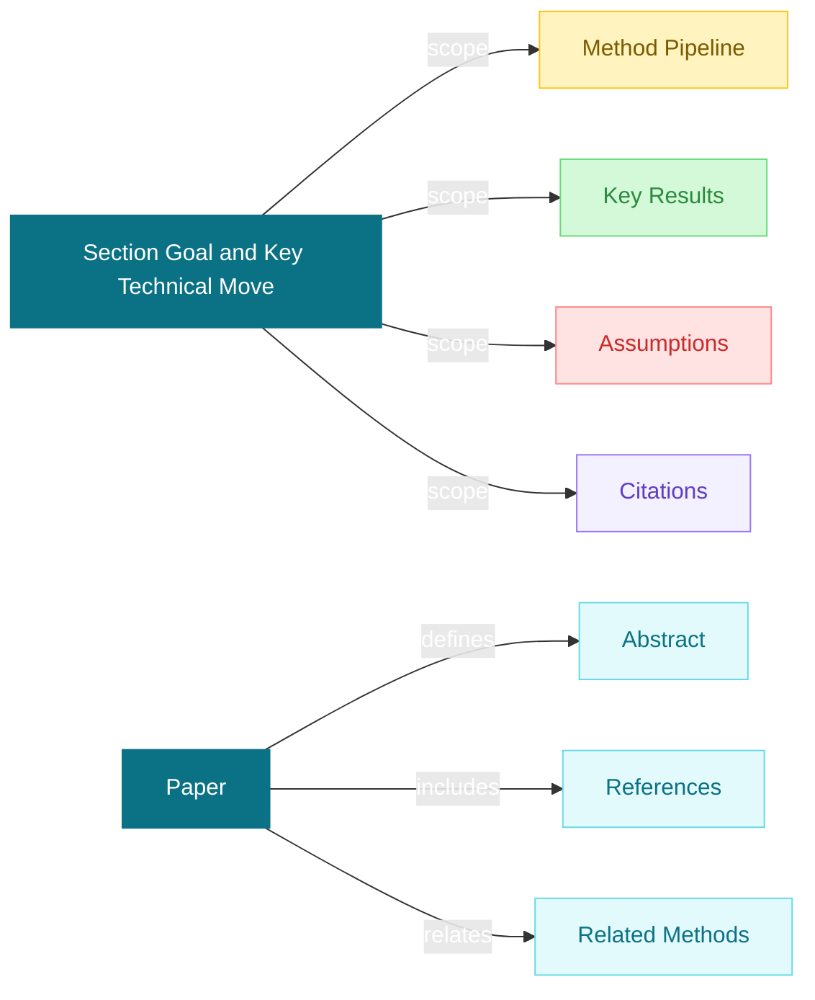

# Mind Map

```mermaid
flowchart LR
    root["Section Goal and Key Technical Move"]
    paper["Paper"]
    abstract["Abstract"]
    references["References"]
    related_methods["Related Methods"]
    method_pipeline["Method Pipeline"]
    key_results["Key Results"]
    assumptions["Assumptions"]
    citations["Citations"]
    paper -- "defines" --> abstract
    paper -- "includes" --> references
    paper -- "relates" --> related_methods
    root -- "scope" --> method_pipeline
    root -- "scope" --> key_results
    root -- "scope" --> assumptions
    root -- "scope" --> citations
    classDef root fill:#0b7285,color:#fff,stroke:#0b7285,stroke-width:2px;
    classDef section fill:#e3fafc,stroke:#66d9e8,color:#0b7285;
    classDef method fill:#fff3bf,stroke:#fcc419,color:#7c5b00;
    classDef result fill:#d3f9d8,stroke:#69db7c,color:#2b8a3e;
    classDef assumption fill:#ffe3e3,stroke:#ff8787,color:#c92a2a;
    classDef citation fill:#f3f0ff,stroke:#9775fa,color:#5f3dc4;
    class root root;
    class paper root;
    class abstract section;
    class references section;
    class related_methods section;
    class method_pipeline method;
    class key_results result;
    class assumptions assumption;
    class citations citation;
```
